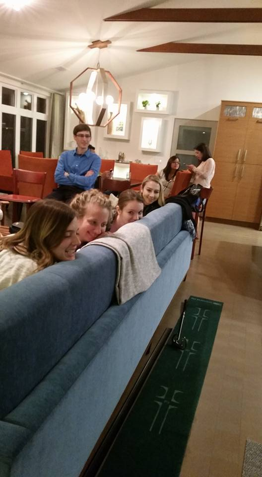
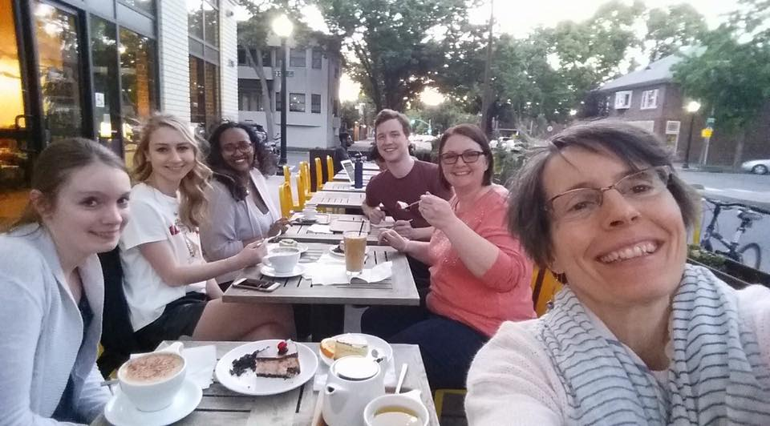
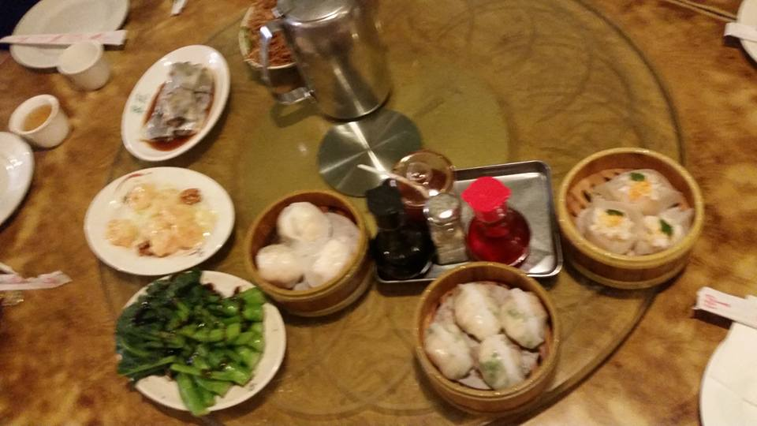
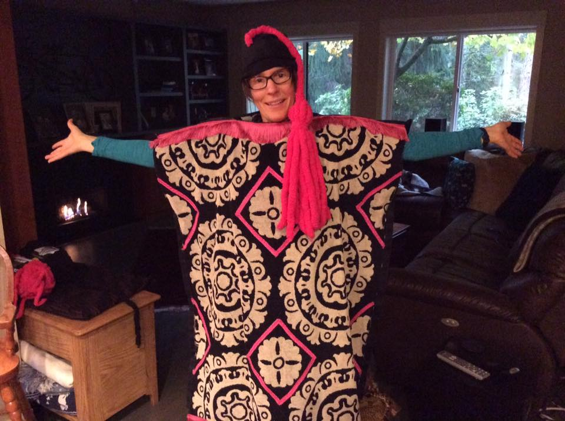

 

We strive to create a culture of collaboration -- and fun.  In a typical year we:

* have a fall welcome party
* attend WPA together -- working hard, but also happy hours and tapas
* have a commencement BBQ
* when dissertation proposals and defenses are in person, RVT members bring treats so that the dissertant only has to worry about the defense (and then we hang out afterward to celebrate)

Pictured below are snaps of some of the fun. *As someone who is still relatively new to R, I haven't yet figured out how to rotate the images.*

## APA 2022, Minneapolis

 

 

## WPA 2022, Portland

 

 

 

## APA 2019, Chicago

 

{#id .class width=400}

{#id .class width=400}

{#id .class width=400}

 

## A Jenga Competition at WPA, Long Beach

 

{#id .class width=400}

{#id .class width=400}

{#id .class width=400}

## Adventures at WPA

 

{#id .class width=400}

{#id .class width=400}

{#id .class width=400}

 

## Serious about Food

 

{#id .class width=400}

{#id .class width=400}

{#id .class width=400}

{#id .class width=400}

{#id .class width=400}

 

{#id .class width=400}

{#id .class width=400}

 

## More than One Costume Contest

 

{#id .class width=400}

{#id .class width=400}

 

{#id .class width=400}

{#id .class width=400}

 

{#id .class width=400}

{#id .class width=400}

## Celebrating Commencement

 

{#id .class width=900}
  

{#id .class width=900}
  

