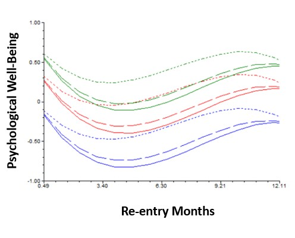
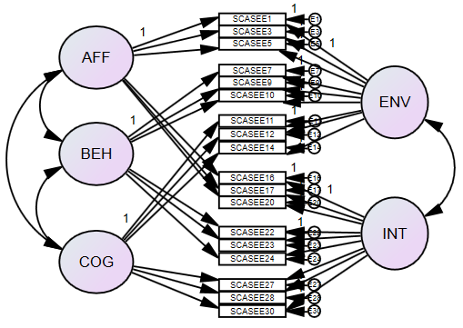
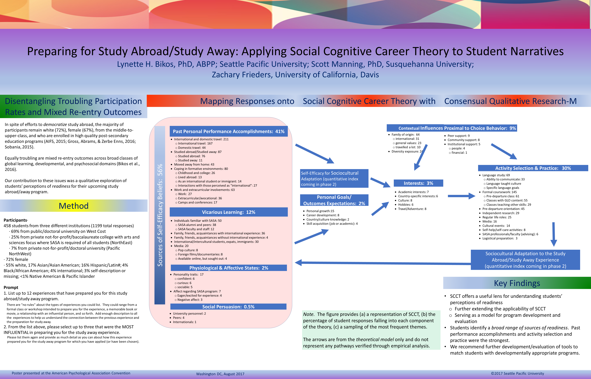

  

Beginning with the development and evaluation of a Job Search Club for International Students (Bikos & Furry, 1999), created during her pre-doctoral internship, extending into expatriation/repatriation, and more recently on education abroad, Dr. Bikos has long held interests in global psychology. She is particularly interested in how people transition into culturally diverse contexts. These are examples of recently published projects -- each of which have a well of unexplored data.

# GLO Abroad  

GLOabroad.  In June 2009 our RVT launched a mixed methods (i.e., qualitative and quantitative), longitudinal, investigation of the psycho-social-spiritual-educational outcomes of SPU students who are travelling internationally for traditional study abroad and faith-based global service learning. We assessed the students 3 months prior to departure, and then 2-weeks, 6-weeks, 3-months, 6-months, 9-months, and 12-months after their reentry. Presently, we have data from around 270 SPU international immersion learning students (and a control group of 70 students who did not travel internationally.  

  
Liz Dykhouse's ('16) doctoral dissertation found some of the first evidence of what some have termed "re-entry shock."  Given the mild-to-moderate trough and return to baseline within a year, we encourage education abroad advisors to offer training in coping skills during the program, to frame any re-entry struggles "re-entry friction," and encourage individual exploration during this time.

  
{#id .class width=500}

  

# Self-Efficacy for Sociocultural Adaptation Scale 

  
{#id .class width=500}

  
Rebekah Forman's ('14) doctoral dissertation was the creation and evaluation of a scale that assesses self-efficacy for sociocultural adaptation. The flexible scale can examine self-efficacy along environmental and interpersonal contexts; affective, behavioral, or cognitive tasks; as a combination of those two factors (e.g., affective tasks in the interpersonal context).

  

# Global Psych Pubs 

* Bikos, L. H., Forman, R., & Patton, K. M. (2021). The Self-Efficacy for Sociocultural Adaptation Scale (SESCAS):  Development and initial psychometric evaluation.  The Counseling Psychologist, 49(1), 33-79. https://journals-sagepub-com.ezproxy.spu.edu/doi/10.1177/0011000020951861 
* Gibbs, R., Güneri, O. Y., Pankau, T., & Bikos, L. H. (2020). Birds of a Feather Fare Less Well Together: Modeling Predictors of International Student Adaptation. Sustainability, 12(6), 2317. https://doi.org/10.3390/su12062317 Available at:  https://www.mdpi.com/2071-1050/12/6/2317 
* Dykhouse, E. C., & Bikos, L. H. (2019). Re-entry friction: The curious effects of cultural dislocation on outcomes for global service learning returnees.  International Journal of Intercultural Relations, 72 (96-108). https://doi.org/10.1016/j.ijintrel.2019.07.004
* Bikos, L. H., Manning, S. B., & Frieders, Z. J. (2019). Ready or not here I come: A qualitative investigation of students’ readiness perceptions for study abroad/away. International Perspectives in Psychology: Research, Practice, Consultation, 8(2), 78–91. https://doi-org.ezproxy.spu.edu/10.1037/ipp0000105 
* Coyer, C., Gebregiorgis, D., Patton, K., Gheleva, D., & Bikos, L. (2019). Cultivating global learning locally through community-based experiential education. Journal of Experiential Education, 42(2), 155-170. doi: 10.1177/1053825918824615 Retrieved from: https://journals.sagepub.com/doi/full/10.1177/1053825918824615
* Bikos, L. H., Rodney, H., Gowen, M., Yamamoto, Y., & Dykhouse, E. C. (2015). Effects of searching, faith, and time on the presence of calling in international service learning returnees. Journal of Psychology and Christianity, 34 (4), 325-339.

  

# Global Psych Posters 

{#id .class width=800}

  

{#id .class width=800}

  

{#id .class width=800}

