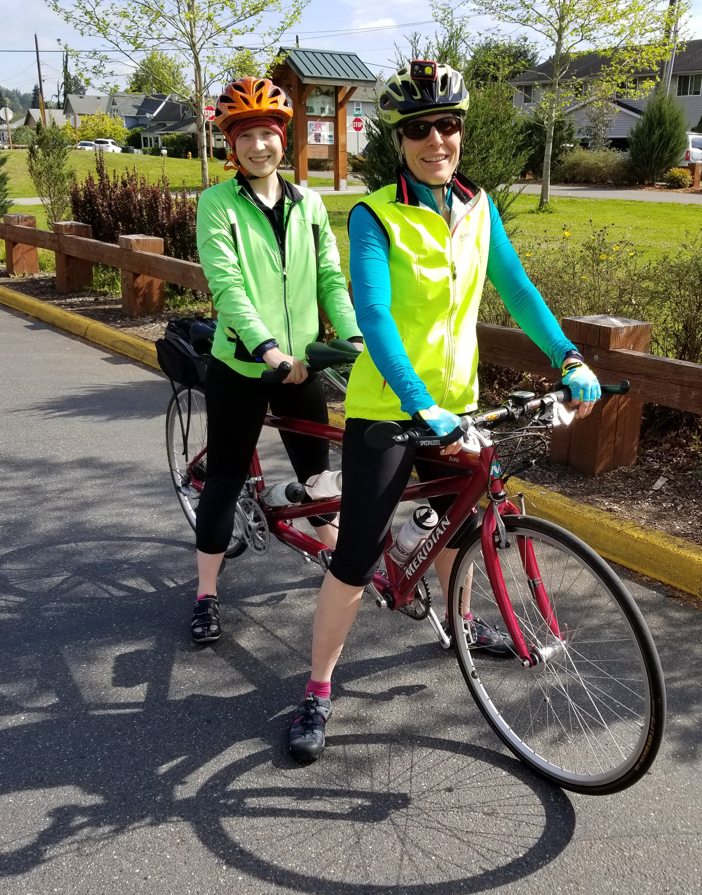
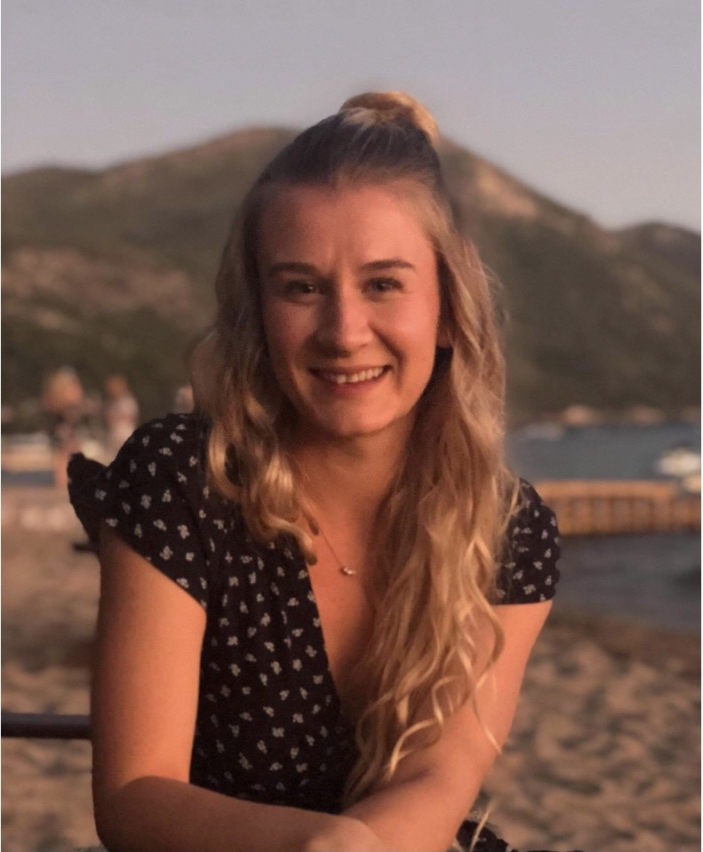
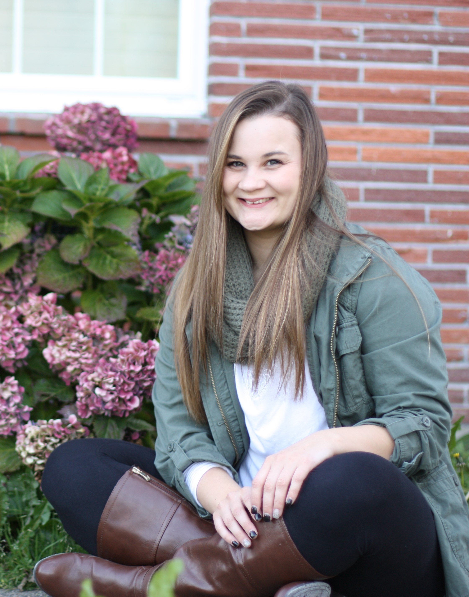
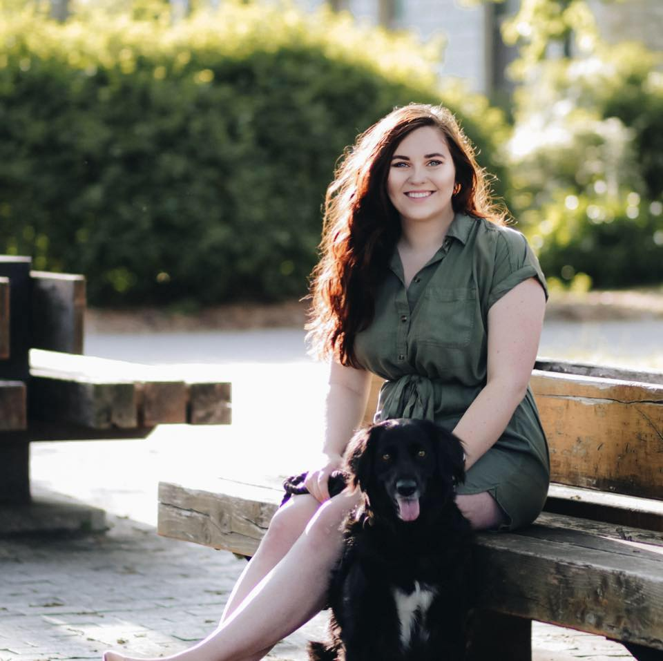
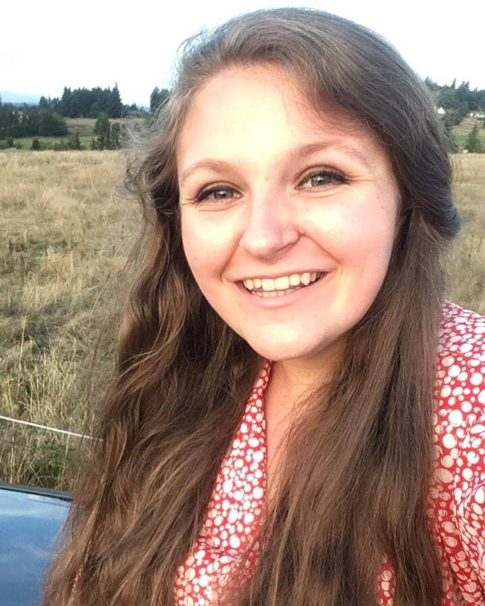
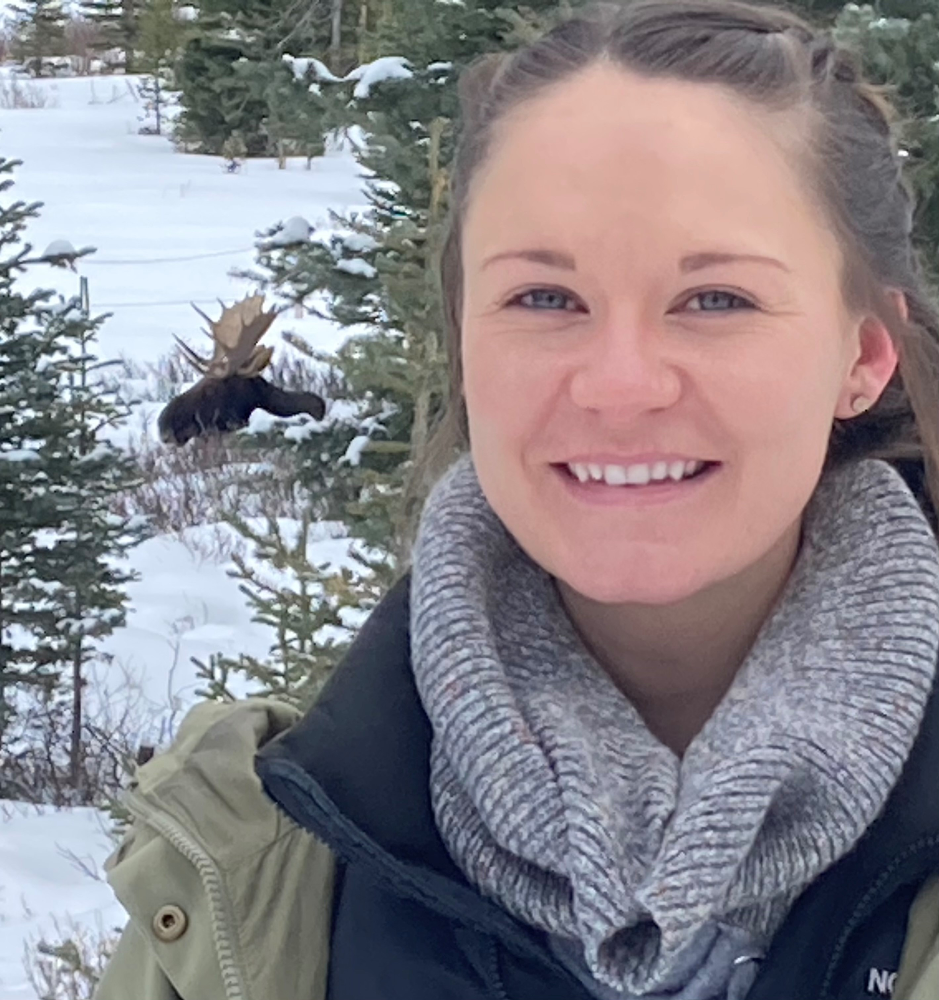
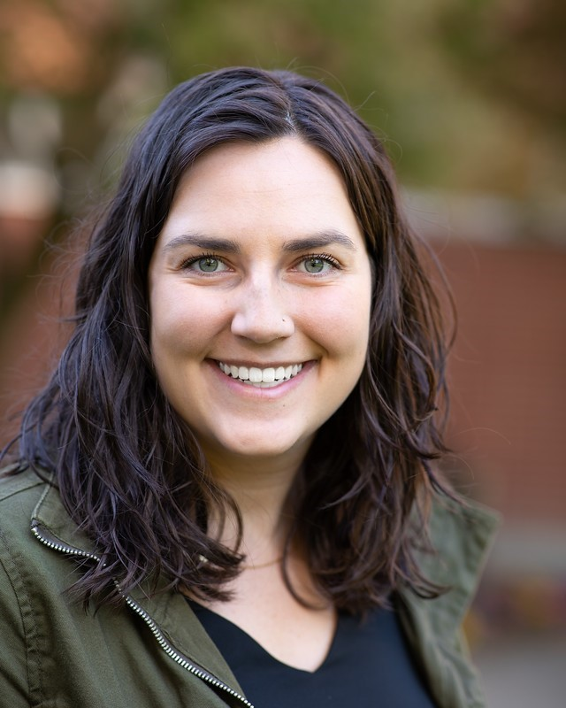
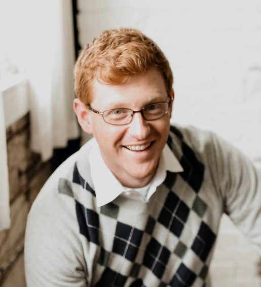
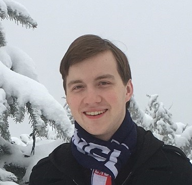

<em>Click to listen to a screencasted [personal introduction](https://spu.hosted.panopto.com/Panopto/Pages/Viewer.aspx?pid=8ebf1a26-498e-4012-a63c-acbf0051dbf2&id=4e6b5d7b-7aea-4b04-be92-acc300081933&advance=true) from Dr. Bikos. Here is Dr. Bikos' response to the question, ["What should we call you?"](https://spu.hosted.panopto.com/Panopto/Pages/Viewer.aspx?pid=8ebf1a26-498e-4012-a63c-acbf0051dbf2&id=e239ca32-6e64-4249-81cf-acc3000df788&advance=true) </em>

# Faculty Advisor:  Lynette H. Bikos, PhD, ABPP 

 

Education: BA, University of Missouri-Columbia, 1987; MA, University of Missouri-Columbia, 1989; PhD, University of Kansas-Lawrence, 1996. At SPU since 2005.

 
Dr. Lynette Bikos (she/her/hers, pronounced "bike-us") teaches statistics, research methods, and psychometrics courses in the Clinical and Industrial-Organizational Psychology doctoral programs at Seattle Pacific University. She is a licensed psychologist in Washington and Kansas and Board Certified in Counseling Psychology.  Her expertise falls at the intersections of vocational, global, and sustainable psychology.  

Dr. Bikos’ first love is career development.  At SPU Dr. Bikos engaged in both the science and practice of vocational psychology by providing clinical supervision for the Graduate Career Advisors at SPU’s Center for Center for Career and Calling and in their work as facilitators for *CALLED!  SPU’s Online Field Guide* (OFG; Canvas edition).  Dr. Bikos is the Principal Investigator of a random clinical trial evaluating differences between three versions of the OFG – particularly looking to see if the calling-infused version contributes to vocational outcomes over-and-above adjustment-to-college and traditional-career-planning versions.  

Dr. Bikos is particularly interested in understanding how individuals respond to change -- plotting longitudinal growth trajectories examining the simultaneous effects of individual and contextual factors.  Significant research projects have explored global learning outcomes in returnees from study abroad, first year adaptation of expatriate spouses, and career development in response to the OFG.  During the COVID-19 pandemic, she is investigating experiences of and attitudes toward making(sewing) and wearing cloth facemasks.  Whether in a videoconference or around a table, planning, implementing, analyzing, and discovering with her advisees is one of her greatest joys.  

{#id .class width=500}

 
In the larger profession of psychology, Dr. Bikos presently serves on the editorial boards of the *Journal of Vocational Behavior*, *Career Development Quarterly*, and *International Perspectives in Psychology:  Research, Practice, Consultation*; and has previously served on the *Journal of Counseling Psychology* and *Journal of Career Development* editorial boards.  She is a Fellow in both the American Psychological Association (Division 52/International Psychology) and the Western Psychological Association. She is currently holding a 3-year term (2019-2021) as Vice President for Engagement in APA’s Division 52/International Psychology.

Dr. Bikos’ commitment to global begins at home. Her family has hosted more than a dozen exchange students (and teachers). She is an avid bicycle commuter, accruing over 2,000 miles annually in her trek to-and-from campus. She also spends a fair amount of time experimenting the kitchen – particularly with international recipes and ingredients.

Additional profiles are provided on the [faculty profile](https://spu.edu/academics/school-of-psychology-family-community/faculty-and-staff/lynette-bikos-profile) at Seattle Pacific University and at [LinkedIn](https://www.linkedin.com/in/lhbikos/)
 

{#id .class width=500}
 

# Current RVT Members

 

{#id .class width=500}

**Clara (Thea) O’Brien** (she/her/hers, ~'26) is originally from Western Washington and moved to Seattle to pursue her doctoral degree in clinical psychology at SPU. She earned her BA in psychology from Pacific Lutheran University in 2015, where she conducted qualitative and quantitative research on children’s trust in adult testimony of healthfulness of foods. She has since spent time working in higher education as an academic coordinator at the University of Idaho before spending time in Europe travelling and volunteering in refugee aid. This is where she developed a passion for crisis care and acute interventions. She then went on to work in outpatient mental health serving adults suffering from SMI for three and a half years. This sparked her desire to pursue a higher degree in clinical psychology. She is interested in trauma work and acute care as it relates to underserved populations. For her Mentored Research Project she is studying the effects of affect and stigma on Mask-Wearing behaviors during the COVID-19 pandemic. These are being examined in the context of COVID-19 infection rates as well as geopolitical context. She works as a Graduate Career Advisor in the Center for Career and Calling at SPU assisting undergraduate students in their career goals. In her free time, she enjoys drinking tea, listening to vinyl records, and backpacking. Pre-pandemic she is an avid concert and museum attender.

 

**Ashley Righetti** (she/her, ~'26) is from Washington State and completed her bachelor’s degree at the University of Washington Tacoma prior to attending Seattle Pacific University to pursue a PhD in Clinical Psychology. During her undergraduate career, Ashley researched students’ self-care practices in relation to academic achievement while looking at facets of psychological well-being as mediating factors. Upon graduating, she stepped away from school in order to consider other pursuits, which is where she developed a new-found interest in aspects of vocational psychology. In particular, she is hoping to eventually investigate the work environment, self-care practices, and how individual’s psychological health is affected. Ashley’s MRP project is focused on mask-wearing in relation to affect while taking into account geopolitical context and COVID-19 practices. When Ashley is not in class or doing schoolwork, she is usually at the gym training in weightlifting. Her goal in the sport is to eventually qualify for the North American Open Finals while also being a full-time student. 

{#id .class width=500}

 

{#id .class width=500}

**Jaylee York** (she/her, ~'26) is originally from Southwestern Kansas, and moved to Seattle to attend graduate school at SPU. She received her Bachelor of Science in Psychology and in Criminology with an emphasis in Conflict Resolution and Trauma Studies at Kansas State University. While at Kansas State, Jaylee was heavily involved in research both in Behavioral Neuropsychology and Social Psychology. During her time as an undergraduate student, Jaylee researched racial and gender prejudice and discrimination, with her largest project being the development of a psychometric tool measuring the recognition of privilege within feminism. Following her undergraduate studies, she worked as a Research Team Lead at Kansas State University in the Memory and Cognition lab. While in graduate school, Jaylee aims to continue to work on the development of psychometric tools, the development of trauma disorders in diverse populations, and work broadly in community mental health. Her current projects include researching stigma and mask usage during the COVID-19 pandemic, longitudinal work with the King County Sexual Assault Resource Center, and the CE program. Outside of school, Jaylee enjoys camping with her partner and their dog, travelling, cooking, and exploring all that Seattle has to offer.

 

{#id .class width=500}

**Linda Montaño** (she/her, ~'23) is a Pacific Northwest transplant who has lived in Texas, Indiana, Michigan, and Ohio.  She’s a doctoral student in the industrial-organizational psychology program.  Linda earned her BA in Business Administration from Hope College in Holland, Michigan and MA in Public Policy and Management from the John Glenn College of Public Affairs at The Ohio State University. Having worked in a wide variety of settings and roles, Linda credits the children, families, caseworkers and wider network of Children’s Protective Services in Austin, Texas with the most formative experiences of her life.  Immediately prior to coming to SPU, Linda worked at The Ohio State University where she served as interim assistant vice provost for global strategies and international affairs and senior director of business operations and administration.  A serendipitous meeting with Dr. Bikos at the Forum on Education Abroad in 2018 propelled Linda to apply to SPU, the I-O program, and ultimately landed her in Dr. Bikos’ RVT.  Within her doctoral research team, Linda is investigating maskmaking (sewing cloth facemasks) during the pandemic in light of work as calling theory (WCT, Duffy et al., 2018).  Additionally, she is analyzing student responses to initial efforts at decolonizing a graduate statistics course.  Linda’s research interests are in topics related to decent work, job crafting, and industrial/organizational psychology.  Linda greatly enjoys being a student, riding Washington state ferries, hiking on beaches, hugging trees, and curling up with a good book on rainy PNW days. 

 
**LeAnne Zaire**, M.S. (she/her/hers; ~'23) is in her 3rd year in the Clinical Psychology PhD program at Seattle Pacific University.  She earned a bachelor of science in psychology from Tennessee State University in 2014 and served two years as a Peace Corps Volunteer in Kyrgyzstan. At SPU LeAnne has held numerous assistantships/fellowships including appointments at SPU’s Center for Career and Calling; the School of Psychology, Family, & Community’s Diversity Committee; the School of Theology’s Leitourgia project; and in Graduate Admissions.  LeAnne’s clinical experience has included career counseling at SPU’s Center for Career and Calling, completing neuropsychological assessments with Dr. Tedd Judd at his multicultural practicum site, and completing assessments the Autism Center at Providence Regional Medical Center.  LeAnne’s dissertation proposes to use “big data” from the National Center for Educational Statistics where she will examine the degree to which having an “own-raced teacher” impacts disciplinary outcomes for Black students. 
 

**Jamie Layton** (she/her/hers; ~’24) was born and raised in Oregon. She moved down to California for college and received her Bachelors of Arts in Psychology with a  minor in Spanish at Biola University in 2017. Jamie joined our team in 2018 as a member of the clinical Psychology program. After her three years in California Jamie was hoping to stay in the PNW for grad school and was excited at all of the opportunities both recreationally and clinically that Seattle had to offer. Jamie is interested in pursing trauma work and highly values multicultural work and serving underserved populations. Her Mentored Research Project (MRP) examined the effect that religious engagement had on trauma experiences and PTSD symptoms in a sample of Somali refugees. For her dissertation she is hoping to use our new King County Sexual Assault Resource Center prevention project. While the exact details are still being worked out one possibility would be to psychometrically validate a consent scale for middle and high school students as we are unaware of any consent scale that currently exists for people this young. Clinically, Jamie has had a practicum placement at Olympia Fire Department where she went on calls and provided milieu therapy to Olympia firefighters, and also provided individual therapy to firefighters and family members throughout all of Thurston County. In addition to her research, classes, and clinical work, Jamie is a stats TA for the program. Outside of school Jamie enjoy cooking, baking, listening to podcasts and audio books, playing board games, and going to Mariners and hockey games. 

{#id .class width=500}

 
**Elena Cantorna**, M.S. (she/her/hers) is in her 4th year in the Clinical Psychology PhD program at Seattle Pacific University. Elena’s clinical interests center in forensic psychology, severe and persistent mental illness, and serving marginalized populations. She currently is completing forensic assessments at Western State Hospital and in private practice with WISe  Psychology (I.e. risk assessments, competency to stand trial evaluations, and mitigating factors). She also completes neuropsychological assessments with Dr. Tedd Judd at his multicultural practicum site, with a focus on advancing her Spanish clinical skills. Elena’s research interest includes program evaluations with community partners to advance programs created to serve marginalized populations to better their programs and resources. She currently is working on her dissertation using data in partnership with the King County Sexual Assault Resource Center looking at COVID-19's impact on resiliency and secondary victimization. 
 

**Beth Larson** (she/her/hers, ~'22) was born and raised in Montana. She graduated with a BS from the University of Montana (2014), earning degrees in both Psychology and Communicative Sciences and Disorders, and graduated from Montana State University (2017) with an MS in Psychological Science (experimental psychology emphasis). She then moved to Seattle to pursue her doctoral degree at SPU (CPY) where she earned her MS in Psychological Science (2019). Beth ultimately chose SPU’s clinical psychology doctoral program because of its strong emphasis of both scientific research and clinical practice and because of its warm and supportive collegial environment. During her time at SPU, Beth has completed practicums at SPU’s Student Counseling Center (2018), Monroe Correctional Complex (2019), Tedd Judd’s Multicultural Practicum (2020), and UW Department of Neurology (2020). In the RVT, Beth has served as lead OFG analyst and as an OFG interventionist. Her dissertation explores the relationship between romantic attachment orientation, marital expectations, and trait mindfulness. In her free time, Beth enjoys hiking/urban walks, reading, and trying out new restaurants/coffee shops in the Seattle area.  

{#id .class width=500}

 

{#id .class width=500}

**Megan Fox** (she/hers, ~'22) moved to Seattle to pursue her doctoral degree after receiving her Bachelor of Art in Psychology from Whitworth University in 2017, earning her Master in Psychological Science from SPU in 2019, and has an expected graduation date with her PhD in 2022. Her clinical interests have included vocational psychology, positive psychology, and adolescents and emerging adults. She has explored these interests further through her practicum work at Seattle Children’s in the PEARL clinic (Program for Education Attention Regulation and Learning) and the OCD Intensive outpatient as well as experiences on campus as Graduate Career Advisor, and the Student Counseling Center. During her time as a graduate career advisor, she had the opportunity to provide career counseling for college students and alumni as well as develop and teach two courses as an adjunct professor for the engineering and computer science departments. In regard to research, she helped develop and maintain an online interactive career intervention since her first year. Both her 2nd year project and dissertation have used longitudinal data within this intervention. Her 2nd year project, completed with Elena and Kate, investigated how flourishing was affected by degree of participation in this online intervention. Her dissertation is investigating how social support effects career adaptability throughout college and how degree of engagement influences both. Megan is originally from Colorado and loves anything outdoors, particularly hiking, fly fishing, and skiing. She also enjoys traveling and reading.

 

**Kirby White** (he/him, ~'21) is an IO Psychology PhD student. He grew up in the Seattle area and enjoyed several years of work before completing his undergraduate studies at SPU, majoring in business administration. Along his scenic career route, he’s served in the United States Marine Corps and worked as a church administrator, a Firefighter/EMT, a general management consultant, and an independent consultant creating automated analytics tools for major tech companies in the Puget Sound region. Kirby enjoys international travel, and would like to volunteer in West Africa again someday. His research interests involve employee engagement, data analytics, organizational effectiveness, and research design.

{#id .class width=500}

 

{#id .class width=500}

**Thomas Pankau** (he/him, ~'22) moved to Seattle to pursue his PhD in clinical psychology in 2016 after earning his Bachelor of Science in Psychology from Washington State University in 2014. He earned his Masters in Psychological Science from SPU in 2018, and his expected graduation is in 2022. Because of his upbringing that included frequently moving from state to state and country to country, his research interests include international and cross-cultural applications of psychology, which have been fostered within the Bikos RVT. His practicum experiences has been wide and varied, focusing mostly on work with children and adolescents, including rotations at Providence Autism Center, Madigan Army Medical Center: Child and Family Clinic, Seattle Children's OCD Intensive Outpatient, Seattle Children's Autism Center: Mood and Anxiety Clinic, Seattle Children's Cancer Survivorship Clinic, and Joon Care. Because of his interest in youth and adolescents, he is currently working on his dissertation which investigates the psychometric properties of a coping self-efficacy measure for adolescents who have experienced sexual assault. He enjoys the small, close-knit community of SPU, and around Seattle enjoys going to record stores and rollerblading around Greenlake.

