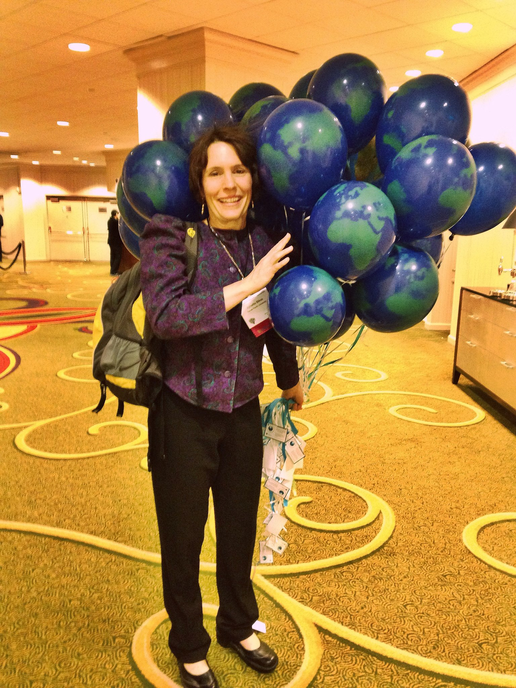

The Bikos RVT is involved in service at varying levels of the institution and the profession of psychology.

## Community - University Partnerships

<em>Click to listen to a screencasted [discussion](https://spu.hosted.panopto.com/Panopto/Pages/Viewer.aspx?pid=8ebf1a26-498e-4012-a63c-acbf0051dbf2&id=cd90d758-fc48-4c20-b3e7-acc00136d912&advance=true) about our program evaluation collaboration with KCSARC.</em>

For more than 15 years the BikosRVT has had a program evaluation partnership with [King County Sexual Assault Resources Center](https://www.kcsarc.org/). Our primary program has been to provide three waves of evaluation (intake, post, follow-up) for the [legal advocacy](https://www.kcsarc.org/legal) program. In consultation with the legal advocates, we developed a bilingual survey (Spanish, English) that assesses a host of variables about coping, well-being, secondary victimization, social support, and satisfaction with the program. This mutually beneficial arrangement provides regular program evaluation data to KCSARC as well as provides RVT members a rich opportunity for dissertations and other research.

A new KCSARC program is aimed at *preventing* sexual assault and is starting in the public schools. The curriculum addresses  Again, the BikosRVT is providing program evaluation support through Qualtrics-hosted surveys that assess changes in the students' understanding of boundaries and consent as well as their self-ratings of empathy and pro-social behaviors.

## Institutional Review Board

At SPU each school is primarily responsible for review of IRB applications from within that school. Because of her role as Associate Dean, one of her advisees often takes the role as administrative coordinator for IRB. the GAA (Graduate Administrative Assistant) receives, quick-checks, logs the application's receipt, assigns the application to an IRB reviewer, and tracks its process.  

## Peer Reviewing

Dr. Bikos is a member of the editorial board of several journals:  *Journal of Vocational Behavior*, *Career Development Quarterly*, *International Perspectives in Research*. Most journals allow co-reviewing with doctoral students. One goal is for each advisee to co-review at least two articles (more are possible) during the program.  

## APA Continuing Education

The Department of Clinical Psychology at SPU is an approved provider of APA CE (both live and homestudy formats).  Another GAA-ship surrounds supporting the CE program.  This entails ensuring that co-sponsorships of CE meet the requirement and in-depth work with Qualtrics for the purpose of gathering/organizing presenter information, obtaining necessary evaluation/verification information from CE particpiants, and distributing certificates.  We have learned to make Qualtrics do much, much, work for us. Given the rigorous standards and the annual audit, this is detail-oriented, professional work.  

 

{#id .class width=500}

## Western Psychological Association

Annually, nearly 80% of the team attends the Western Psychological Association.  The BikosRVT *works* the entire WPA with a number of responsibilities that typically include:

* staffing an SPU exhibit from the admissions office
* co-sponsoring/coordinating the WPA CE program
* representing APA's Division 52/International Psychology by
  - hosting a student/early-career-professional poster contest
  - coordinating internationally focused symposia
  
Additionally, we present our own posters and symposia and attend the "stats camp" (2 hours, daily).  

 

## APA's Division 52/International Psychology

Dr. Bikos has been involved with D52 for a number of years.  Annually, we coordinate poster contests for WPA and APA. Additionally, we co-sponsor the CE for their webinar program.

 

{#id .class width=500}

 

